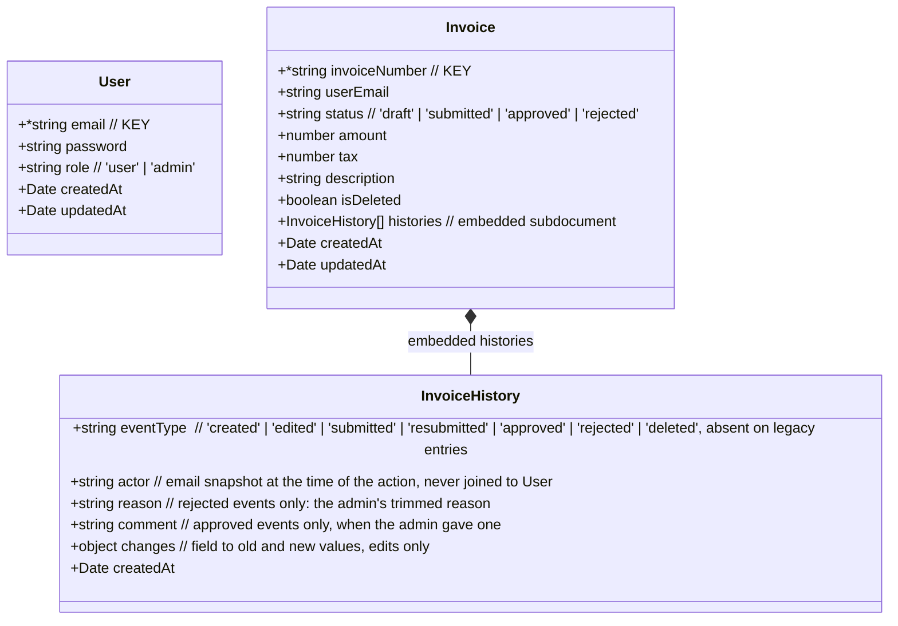

## DATABASE DESIGN

```mermaid
classDiagram
  %% ===== User Collection =====
  class User {
    +*string email  // KEY
    +string password
    +string role  // 'user' | 'admin'
    +Date createdAt
    +Date updatedAt
  }

  %% ===== Invoice Collection =====
  class Invoice {
    +*string invoiceNumber  // KEY
    +string userEmail
    +string status  // 'draft' | 'submitted' | 'approved' | 'rejected'
    +number amount
    +number tax
    +string description
    +boolean isDeleted
    +InvoiceHistory[] histories  // embedded subdocument
    +Date createdAt
    +Date updatedAt
  }

  %% ===== Subdocument inside Invoice =====
  class InvoiceHistory {
    +string eventType  // 'created' | 'edited' | 'submitted' | 'resubmitted' | 'approved' | 'rejected' | 'deleted', absent on legacy entries
    +string actor  // email snapshot at the time of the action, never joined to User
    +string reason  // rejected events only: the admin's trimmed reason
    +string comment  // approved events only, when the admin gave one
    +object changes  // field to old and new values, edits only
    +Date createdAt
  }

  %% ===== Relationships =====
  Invoice *-- InvoiceHistory : embedded histories
```
